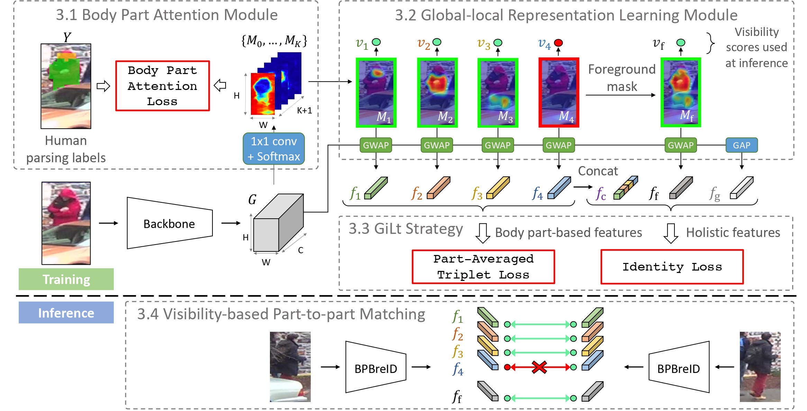
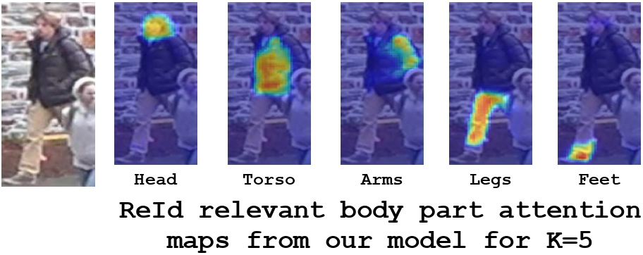
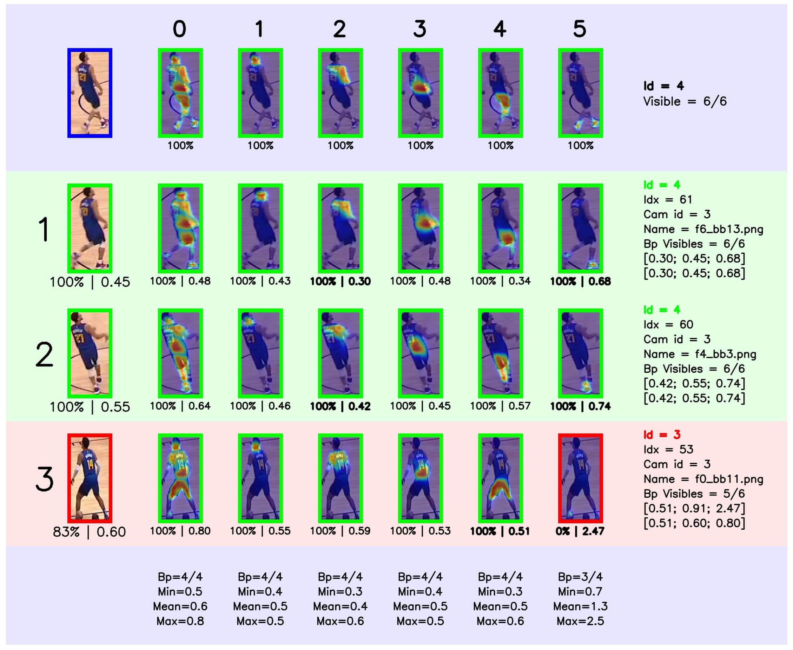

<!-- TODO

-->

# BPBReID: Body Part-based (Occluded) Re-Identification

**A strong baseline for body part-based person re-identification** 

[[Paper](https://arxiv.org/abs/2211.03679)] [[Video](https://www.youtube.com/watch?v=4NQump-vg_A&ab_channel=VladimirSomers)] [[Poster](docs/figures/bpbreid/wacv23_poster_bpbreid.pdf)]

[](https://arxiv.org/abs/2211.03679) [](https://firstdonoharm.dev/version/3/0/law-media-mil-soc-sv.html)

>**[Body Part-Based Representation Learning for Occluded Person Re-Identification, WACV23](https://arxiv.org/abs/2211.03679)**
>
>Vladimir Somers, Christophe De Vleeschouwer, Alexandre Alahi
>
>[*arxiv 2211.03679*](https://arxiv.org/abs/2211.03679)
>

### State-of-the-art performance on 5 datasets:

Occluded-Duke: [](https://paperswithcode.com/sota/person-re-identification-on-occluded-dukemtmc?p=body-part-based-representation-learning-for)

Occluded ReID: [](https://paperswithcode.com/sota/person-re-identification-on-occluded-reid-1?p=body-part-based-representation-learning-for)

P-DukeMTMC: [](https://paperswithcode.com/sota/person-re-identification-on-p-dukemtmc-reid?p=body-part-based-representation-learning-for)

DukeMTMC-ReID: [](https://paperswithcode.com/sota/person-re-identification-on-dukemtmc-reid?p=body-part-based-representation-learning-for)

Market1501: [](https://paperswithcode.com/sota/person-re-identification-on-market-1501?p=body-part-based-representation-learning-for)

&nbsp;
<p align="center"></p>
&nbsp;

## News
- [2023.09.20] New paper and big update coming soon 🚀 ...
- [2023.07.26] The Python script from @samihormi to generate human parsing labels based on PifPaf and MaskRCNN has been released, have a look at the "Generate human parsing labels" section below. This script is different from the one used by the authors (especially when facing multiple pedestrians in a single image): resulting human parsing labels will not be exactly the same.
- [2023.06.28] Please find a non-official script to generate human parsing labels from PifPaf and MaskRCNN in this [Pull Request](https://github.com/VlSomers/bpbreid/pull/18). The PR will be merged soon.
- [2022.12.02] We release the first version of our codebase. Please update frequently as we will add more documentation during the next few weeks.

## What's next
We plan on extending BPBReID in the near future, put a star and stay updated for future changes:
- part-based video/tracklet reid
- part-based reid for multi-object tracking
- ...

<!--
Table of content tool:
https://ecotrust-canada.github.io/markdown-toc/
-->

## Table of content
- [BPBReID: Body Part-based Re-Identification](#bpbreid--body-part-based-re-identification)
  * [News](#news)
  * [What's next](#what-s-next)
  * [Table of content](#table-of-content)
  * [Introduction](#introduction)
  * [What to find in this repository](#what-to-find-in-this-repository)
  * [Instructions](#instructions)
    + [Installation](#installation)
    + [Download human parsing labels](#download-human-parsing-labels)
    + [Generate human parsing labels](#generate-human-parsing-labels)
    + [Download the pre-trained models](#download-the-pre-trained-models)
    + [Inference](#inference)
    + [Training](#training)
    + [Visualization tools](#visualization-tools)
  * [Other works](#other-works)
  * [Questions and suggestions](#questions-and-suggestions)
  * [Citation](#citation)
  * [Acknowledgement](#acknowledgement)

## Introduction
Welcome to the official repository for our WACV23 paper "_Body Part-Based Representation Learning for Occluded Person Re-Identification_".
In this work, we propose BPBReID, a part-based method for person re-identification using body part feature representations to compute to similarity between two samples.
As illustrated in the figure below, **part-based** ReID methods output multiple features per input sample, i.e. one for each part, whereas standard global methods only output a single feature.
Compared to global methods, part-based ones come with some advantages:

1. They achieve explicit appearance feature alignement for better ReID accuracy.
2. They are robust to occlusions, since only mutually visible parts are used when comparing two samples.

Our model BPBreID uses pseudo human parsing labels at training time to learn an attention mechanism. This attention mechanism has K branches to pool the global spatial feature map into K body part-based embeddings. Based on the attention maps activations, visibility scores are computed for each part.
At test time, no human parsing labels is required.
The final similarity score between two samples is computed using the average distance of all mutually visible part-based embeddings.
Please refer to [our paper](https://arxiv.org/abs/2211.03679) for more information.


<!--
&nbsp;
<p align="center"></p>
&nbsp;

&nbsp;
<p align="center"></p>
&nbsp;
-->

## What to find in this repository
In this repository, we propose a framework and a strong baseline to support further research on part-based ReID methods.
Our code is based on the popular [Torchreid](https://github.com/KaiyangZhou/deep-person-reid) framework for person re-identification.
In this codebase, we provide several adaptations to the original framework to support part-based ReID methods: 
- The [ImagePartBasedEngine](torchreid/engine/image/part_based_engine.py) to train/test part-based models, compute query-gallery distance matrix using multiple features per test sample with support for visibility scores.
- The fully configurable [GiLt loss](/torchreid/losses/GiLt_loss.py) to selectively apply id/triplet loss on holistics (global) and part-based features.
- The [BodyPartAttentionLoss](torchreid/losses/body_part_attention_loss.py) to train the attention mechanism.
- The [BPBreID](torchreid/models/bpbreid.py) part-based model to compute part-based features with support for body-part learnable attention, fixed attention heatmaps from an external model, PCB-like horizontal stripes, etc.
- The [Albumentation](https://albumentations.ai/) data augmentation library used for data augmentation, with support for external heatmaps/masks transforms.
- Support for [Weights & Biases](https://wandb.ai/site) and other logging tools in the [Logger](torchreid/utils/logging/logger.py) class.
- An [EngineState](torchreid/utils/engine_state.py) class to keep track of training epoch, etc.
- A new [ranking visualization](torchreid/utils/visualization/visualize_query_gallery_rankings.py) tool to display part heatmaps, local distance for each part and other metrics.
- For more information about all available configuration and parameters, please have a look at the [default config file](scripts/default_config.py).

You can also have a look at the original [Torchreid README](Torchreid_original_README.rst) for additional information, such as documentation, how-to instructions, etc.
Be aware that some of the original Torchreid functionnality and models might be broken (for example, we don't support video re-id yet).


## Instructions
### Installation
Make sure [conda](https://www.anaconda.com/distribution/) is installed.

    # clone this repository
    git clone https://github.com/VlSomers/bpbreid

    # create conda environment
    cd bpbreid/ # enter project folder
    conda create --name bpbreid python=3.10
    conda activate bpbreid
    
    # install dependencies
    # make sure `which python` and `which pip` point to the correct path
    pip install -r requirements.txt
    
    # install torch and torchvision (select the proper cuda version to suit your machine)
    conda install pytorch torchvision cudatoolkit=9.0 -c pytorch
    
    # install torchreid (don't need to re-build it if you modify the source code)
    python setup.py develop
    

### Download human parsing labels
You can download the human parsing labels on [GDrive](https://drive.google.com/drive/folders/1IbCAbjj3XtV3_tFOsCuqBi79ZiDqNc1H?usp=sharing). 
These labels were generated using the [PifPaf](https://github.com/openpifpaf/openpifpaf) pose estimation model and then filtered using segmentation masks from [Mask-RCNN](https://github.com/facebookresearch/detectron2).
We provide the labels for five datasets: **Market-1501**, **DukeMTMC-reID**, **Occluded-Duke**, **Occluded-ReID** and **P-DukeMTMC**.
After downloading, unzip the file and put the `masks` folder under the corresponding dataset directory.
For instance, Market-1501 should look like this:

    Market-1501-v15.09.15
    ├── bounding_box_test
    ├── bounding_box_train
    ├── masks
    │   └── pifpaf_maskrcnn_filtering
    │       ├── bounding_box_test
    │       ├── bounding_box_train
    │       └── query
    └── query

Make also sure to set `data.root` config to your dataset root directory path, i.e., all your datasets folders (`Market-1501-v15.09.15`, `DukeMTMC-reID`, `Occluded_Duke`, `P-DukeMTMC-reID`, `Occluded_REID`) should be under this path.
We plan to add automatic download of these labels in the future.
We also plan to release the python script to generate these labels for any given dataset.


### Generate human parsing labels

You can create human parsing labels for your own dataset using the following command:

    conda activate bpbreid
    python scripts/get_labels --source [Dataset Path] 

The labels will be saved under the source directory in the *masks* folder as per the code convention.


### Download the pre-trained models
We also provide some [state-of-the-art pre-trained models](https://drive.google.com/drive/folders/1aUjpSXXVGtAh2nzV0RVsCq0tTXuDZWoH?usp=sharing) based on the HRNet-W32 backbone.
You can put the downloaded weights under a 'pretrained_models/' directory or specify the path to the pre-trained weights using the `model.load_weights` parameter in the `yaml` config.
The configuration used to obtain the pre-trained weights is also saved within the `.pth` file: make sure to set `model.load_config` to `True` so that the parameters under the `model.bpbreid` part of the configuration tree will be loaded from this file.

### Inference
You can test the above downloaded models using the following command:

    conda activate bpbreid
    python scripts/main.py --config-file configs/bpbreid/bpbreid_<target_dataset>_test.yaml
    
For instance, for the Market-1501 dataset:

    conda activate bpbreid
    python scripts/main.py --config-file configs/bpbreid/bpbreid_market1501_test.yaml
    
Configuration files for other datasets are available under `configs/bpbreid/`.
Make sure the `model.load_weights` in these `yaml` config files points to the pre-trained weights you just downloaded. 

### Training
Training configs for five datasets (Market-1501, DukeMTMC-reID, Occluded-Duke, Occluded-ReID and P-DukeMTMC) are provided in the `configs/bpbreid/` folder. 
A training procedure can be launched with:

    conda activate bpbreid
    python ./scripts/main.py --config-file configs/bpbreid/bpbreid_<target_dataset>_train.yaml
    
For instance, for the Occluded-Duke dataset:

    conda activate bpbreid
    python scripts/main.py --config-file configs/bpbreid/bpbreid_occ_duke_train.yaml

Make sure to download and install the human parsing labels for your training dataset before runing this command.

### Visualization tools
The ranking visualization tool can be activated by setting the `test.visrank` config to `True`.
As illustrated below, this tool displays the Top-K ranked samples as rows (K can be set via `test.visrank_topk`). The first row with blue background is the query, and the following green/red rows indicated correct/incorrect matches.
The attention maps for each test embedding (foreground, parts, etc) are displayed in the row.
An attention map has a green/red border when it is visible/unvisible. 
The first number under each attention map indicate the visibility score and the second number indicate the distance of the embedding to the corresponding query embedding.
The distances under the images in the first column on the left are the global distances of that sample to the query, which is usually computed as the average of all other distances weighted by the visibility score.
If you need more information about the visualization tool, fell free to open an issue.

&nbsp;
<p align="center"></p>
&nbsp;

## Other works
If you are looking for datasets to evaluate your re-identification models, please have a look at our other works on player re-identification for team sport events:
- The [SoccerNet Player Re-Identification](https://github.com/SoccerNet/sn-reid) dataset
- The [DeepSportRadar Player Re-Identification](https://github.com/DeepSportRadar/player-reidentification-challenge) dataset 

<p align="center">
  
   
</p>

## Questions and suggestions
If you have any question/suggestion, or find any bug/issue with the code, please raise a GitHub issue in this repository, I'll be glab to help you as much as I can!
I'll try to update the documentation regularly based on your questions. 


## Citation
If you use this repository for your research or wish to refer to our method [BPBReID](https://arxiv.org/abs/2211.03679), please use the following BibTeX entry:
```
@article{bpbreid,
    archivePrefix = {arXiv},
    arxivId = {2211.03679},
    author = {Somers, Vladimir and {De Vleeschouwer}, Christophe and Alahi, Alexandre},
    doi = {10.48550/arxiv.2211.03679},
    eprint = {2211.03679},
    file = {:Users/vladimirsomers/Library/CloudStorage/OneDrive-SportradarAG/PhD/Scientific Literature/Mendeley/Somers, De Vleeschouwer, Alahi_2023_Body Part-Based Representation Learning for Occluded Person Re-Identification.pdf:pdf},
    isbn = {2211.03679v1},
    journal = {Proceedings of the IEEE/CVF Winter Conference on Applications of Computer Vision (WACV23)},
    month = {nov},
    title = {{Body Part-Based Representation Learning for Occluded Person Re-Identification}},
    url = {https://arxiv.org/abs/2211.03679v1 http://arxiv.org/abs/2211.03679},
    year = {2023}
}
```

## Acknowledgement
This codebase is a fork from [Torchreid](https://github.com/KaiyangZhou/deep-person-reid)


